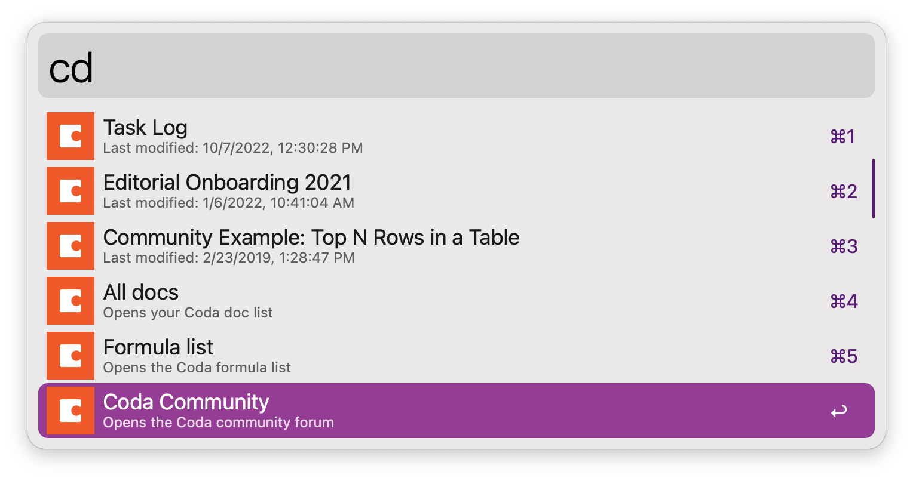

# CodaAlfredJS

Browse [Coda](https://coda.io) in [Alfred](https://alfredapp.com) — written in JavaScript!

This Alfred workflow was inspired **very** heavily by Daniel Stieber's original [CodAlfred](https://github.com/danielstieber/CodAlfred) workflow. But CodAlfred was written in PHP, and as of macOS Monterey, Apple has stopped pre-installing PHP on macOS. PHP can be reinstalled and there are methods for [reenabling PHP for Alfred](https://www.alfredforum.com/topic/17062-using-php-on-monterey-macos-12/), but writing a new Coda/Alfred workflow in JavaScript seemed like a more direct solution — hence, **CodaAlfredJS**.

Easy setup:
- 💻 Download and install the CodaAlfredJS workflow.
- 🔐 Enter your [Coda API](https://coda.io/account) in the "Configure Workflow" box when prompted.
- 😀 Browse Coda via Alfred. That's it!

## Usage
You will need an API access token from Coda to query your data with the Coda API. To get that token:
- From any Coda page, choose your avatar, then the three vertical dots, and then "Account Settings" (or follow the [Account Settings](https://coda.io/account) link).
- Scroll to "API Settings," and generate an API token with read and write access to your docs.

## Commands
Command|Function
-|-
cd|Lists your Coda docs. Type to narrow the list; enter to open the doc in your browser.
cdn|Creates a new Coda doc. The workflow will first ask you for a name for the doc; then it will list your Coda folders for where to place the doc. After you choose the folder, the new, blank doc will open in your browser.
cda|Opens your Coda doc list.
cdc|Opens the Coda forums.
cdf|Opens the Coda formula list.
cdapi|Opens the Coda API reference.

## Preferences
Under the Alfred workflow's User Configuration, `doc_limit` is set to `10` by default. This controls how many docs are returned by the `cd` command; modify this for fewer/more results.

## Roadmap
- Duplicate a doc
- Browse/modify your Coda documents from the doc to the cell level ...

## Privacy
No user data is shared with me via this Alfred workflow. Your Coda API access token is not included if you duplicate or export the workflow.

## Thanks
- [Daniel Stieber](https://www.danielstieber.com) and his original [CodAlfred](https://github.com/danielstieber/CodAlfred) workflow
- [Sindre Sorhus](https://sindresorhus.com) and his fantastic [Alfy](https://github.com/sindresorhus/alfy) library for Alfred JavaScript workflows (plus a variety of his other [apps](https://sindresorhus.com/apps) that I use daily)
